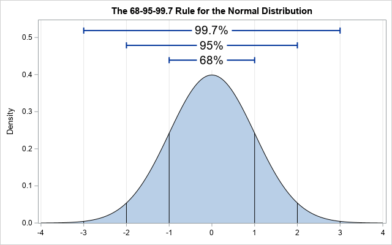

```{r setup, include=FALSE}
knitr::opts_chunk$set(echo = TRUE)
```

## Using simulations 

Today, we're going to be talking about simulating data. Not in a 'making up 
data' unethical framework, but using our assumptions and knowledge about 
to build simulated data, and then comparing that to data we've collected. This 
has a number of benefits over just comparing to summary statistics of data...  

We'll talk about all of this in a second.  

## Scenario - Research is costly  
So here is the basic scenario. We found a correlation between eating fish and 
people getting sick, but that isn't really the root of the problem. We don't 
actually know if rates of disease are present above average levels in the tanks, 
and we definitely don't know what kinds of factors are contributing to this 
problem (if there is one!).  

Our first challenge is that we can't sample the disease rate in all tanks - it's
too expensive and it takes too long. So we're going to task our aqauaculture  
scientists to take a sub-sample (50 tanks). Our aquaculture scientists have shared this 
data with us, and we can access it here:  
[https://tinyurl.com/yf3pv3am ](https://tinyurl.com/yf3pv3am).  

Let's scope it out:
```{r}
library(tidyverse)

sick_fish = read_csv("https://tinyurl.com/yf3pv3am")
glimpse(sick_fish)
```

## Group challenge  
What is the mean number of sick fish for each species (both in terms of numbers 
and percentage of the entire tank?  

```{r}
sick_fish %>%
  group_by(species) %>%
  summarize(mean_sick = mean(num_sick),
            mean_perc = mean(num_sick/num_fish), 
            n = n())
```

## Justifying a simulation  

This seems high, at least for trout, but it could be that it's high because of 
a biased sample, right? Maybe we just happened to pick tanks (17 out of 250), 
with higher numbers. Can we simulate some draws based on an acceptable disease 
percentage and see what we end up getting and then compare this to what our
aquaculture scientists provided us?  

```{r}
# We know our expected outcomes for disease rates in tanks:
# Tilapia = 4%
# Trout = 9%

# Let's generate some data for tilapia to start
# How many fish do we have in each tank? Well, it varies, but on average, it's...
fish_tank_data = read_csv("https://tinyurl.com/tbyskxl")
fish_tank_data %>%
  group_by(species) %>%
  summarize(mean_num_fish = mean(num_fish))

# About 100 for tilapia and 74 for trout. 
# So 4% of 100 is 4, we expect about 4 sick for each tank, but this is on 
# average...
```

## The normal distribution  
So, we want to build a simulation that is 4 fish sick on average from a tank, 
but we want to realistically simulate natural variation across fish tanks. There
aren't going to be exactly 4 fish sick in every tank if we have our expectations. 
We can simulate this using something called the normal distribution, which is 
just a bell curve.  



There is a lot going on here that you don't need to worry about. We have standard
deviations across the x-axis, and the percentages of where the data fall across
the top. The mean/median of the data falls at the center of the peak. The big
takeaway here is that we can use this distribution to model our data... most of 
the data will fall close to the mean we set, with a fewer random points further 
outside.  

```{r}
# We can use the function rnorm to randomly draw values from a normal 
# distribution that we set up ahead of time.  

# Let's just plot a normal distribution  
x = seq(-10, 10, length = 500)
y = dnorm(x, sd = 1)
y2 = dnorm(x, sd = 4)

plot(x, y, type = "l")
lines(x, y2, type = "l", col = "blue")

#Discussion of what this means when we're simulating data
rnorm(n = 1, mean = 4, sd = 1)

sick_tilapia_sim = rnorm(n = 33, mean = 4, sd = 1)
sick_tilapia_sim = round(rnorm(n = 33, mean = 4, sd = 2))
sick_tilapia_sim
mean(sick_tilapia_sim)/100

```

## Group Challenge  
Perform the same thing above, except:  
1. Do it for trout instead of tilapia  
2. Make a function instead of just ad lib like I did  
3. Test your function to make sure it works

```{r}
fish_sick_simulator = function(mean = NULL, species = "trout", sd = NULL){
  if(species == 'trout'){
    sick_fish_vec = round(rnorm(n=17, mean = mean, sd = sd))
    return(mean(sick_fish_vec)/74)
  } else {
    sick_fish_vec = round(rnorm(n=33, mean = mean, sd = sd))
    return(mean(sick_fish_vec)/100)
  }
}

# 9% of 74 for trout... 
74*0.09
fish_sick_simulator(mean = 6.66, species = "trout", sd = 2)
```

## Followup questions:  
1. Why is the number different every time we run the simulation? 
2. Given that this is the case, what could we do to make our simulation more 
realistic?   

