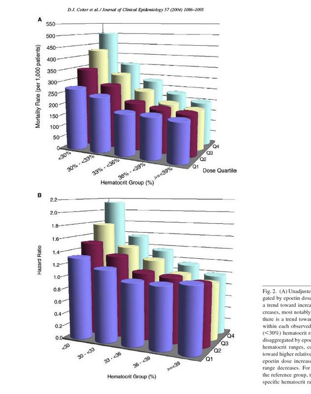
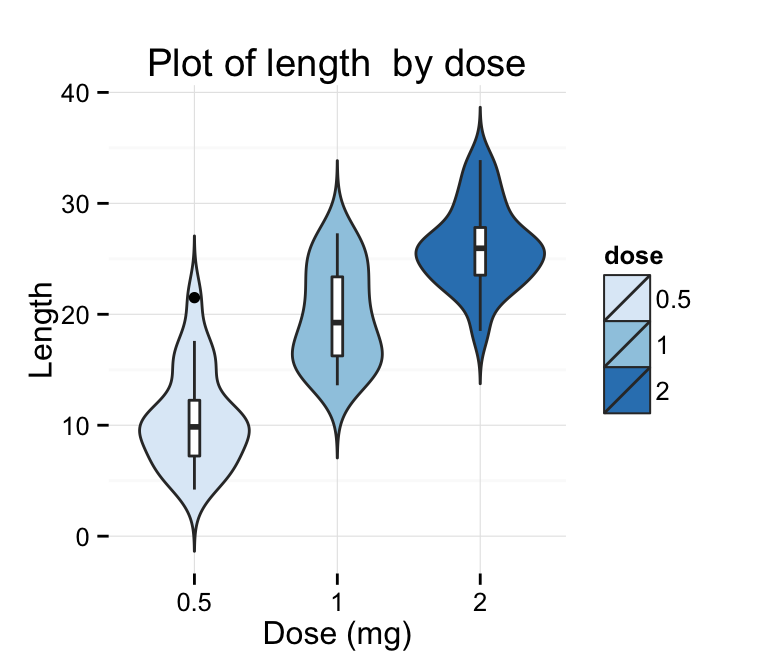
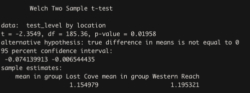

```{r setup, include=FALSE}
knitr::opts_chunk$set(echo = TRUE)
```

## Exam 3 - Seals, seals, seals as far as the eye can see  
**Assessment Goals**  
Overall, students should have picked up a few essential DS skills over the 
course of this module:  
1. Review of dplyr tidyverse workflow - fluency in the pipe, group_by, filter, 
select and summarize
2. Basic familiarity with ggplot2 syntax and structure. The ability to create
simple plots (histograms, scatter plots and box plots from data)
3. Critically assess plot quality, creatively express different ways to plot 
data
4. An understanding how to implement t-tests in R, what they are used for, and 
to extract meaning from components (t-value, p-value, confidence interval)
5. Be able to describe machine learning generally, and have a graphical 
understanding of how k-nn works. 
6. Be able to implement k-nn on sample data sets, as well as interepret output
figures from k-nn building. 

### Question 1  
What are TWO mistakes from the code below, designed to create a color-coded 
scatterplot from two columns of data from our aquaculture team that plots the 
growth of tilapia in an aquaculture tank over time?

```{r, eval=FALSE}
ggplot(aes(x = time, y = weight, color = fish_id)) +
  geom_point(shape = 16, size = 4) +
  theme_classic() +
  xlab("Fish weight (g)") +
  ylab("Time (hours)") +
  scale_color_discrete(name = "Fish ID")

```

### Question 2  
Briefly describe (2-5 sentences) some problems with the figure below, and how 
you would modify or change the figure to improve it. 


### Question 3  
Write some psuedo-code (it doesn't have to be syntaxically perfect, but it 
should generally convey your thought process) to solve the following challenge. 
You have a dataframe called seal_data that contains 5 columns:  
1. IDs for individual seals (data for 76 seals in total) - seal_id   
2. Seal weight (taken  multiple times over the course of a year) - weight  
3. Seal sex (M or F) - sex  
4. Testosterone levels - test_level  
5. Location captured (a general location for where each seal was captured and 
measurements were taken) - loc  

You're interested in two things: 1) finding the average weight of male and 
female seals from each location (don't separate by sex here), and 2) determining whether or not there is a significant difference in testosterone between male 
and female seals across all locations. 

### Question 4
Using the same hypothetical data set, write code using tidyverse/dplyr syntax that computes a summary of the dataframe that includes an average weight and testosterone level for each seal over the course of the year and the standard deviation of weight and testosterone level for each seal. Account for the fact that there is some 
missing data in the weight and testosterone columns (some seals escaped capture 
and researchers were unable to get this information).  

```{r, eval=FALSE}
seal_data %>%
  group_by(seal_id) %>%
  summarize(avg_weight = mean(weight, na.rm = TRUE), 
            avg_test = mean(test_level, na.rm = TRUE), 
            sd_weight = sd(weight, na.rm = TRUE), 
            sd_test = sd(test_level, na.rm = TRUE))
```

### Question 5 
Imagine that you're talking to a colleague who is interested in learning more 
about machine learning and applying it to their research. In your own words, and
in plain English, describe what machine learning is, and how the k-nn algorithm 
we built in class functions (4-10 sentences). 


### Question 6
What type of join would you use in the following scenario? You have two 
data frames that you want to combine - one that contains biometric information 
on team Antartica members (height, weight, gender, blood tests) and another that 
has medical and dietary data (percentage of diet from different sources, 
caloric intakes, exercise regime). Each data set has one column in common, the
team member ID column (names are messed up as one database has the names people
go by, while another has folks' names that are on their Social Security Cards). 

You're interested in finding data on people that appear in one data table but 
not the other (some data has gone missing, and you're trying to track down 
whose data we need to complete the database). 

a. anti-join
b. full-join with filters
c. semi-join
d. left-join then right-join 
e. inner-join

### Question 7  
Briefly (3-5 sentences) explain the difference between a classification problem 
(like the one we tackled in class using k-nn) and a regression problem (feel 
free to use the web and note that this exam is open book, open note, open 
everything!). Cite your sources appropriately if you use them!


### Question 8  
Imagine that you want to create the figure below using ggplot2 syntax. What are
the different components? What geom would you use? Can you interpret what the 
pointed bubbles (violins) are depicting? (5-7 sentences)



### Question 9  
You have examined a data set that has values for testosterone levels for male 
leopard seals that inhabit two different locales. One of the main research 
questions the team wants to answer with this data is whether or not there is
a significant different in testosterone between these populations, and whether 
we can link this to agressive behavior towards the fishing team. 

You ran a t-test to compare the means of testosterone levels between the two 
groups and were presented with the output below. How would you interpret the 
output of this test and communicate your findings to others?

```{r}
data = data.frame(seal_id = seq(1:433), 
                  location = c(rep("Western Reach", 288), 
                               rep("Lost Cove", 433-288)), 
                  test_level = c(rnorm(288, mean = 1.2, sd = 0.1), 
                                 rnorm(433-288, mean = 1.15, sd = 0.2)))

t.test(test_level ~ location, data = data)

```




### Question 10  
We've worked our way through three modules of material now since the beginning 
of the semester. Pick one topic we've covered so far (e.g. machine learning, joins, 
data visualization, summarizing, t-tests) and briefly describe how it might be
useful to you in your future work (3-7 sentences).

